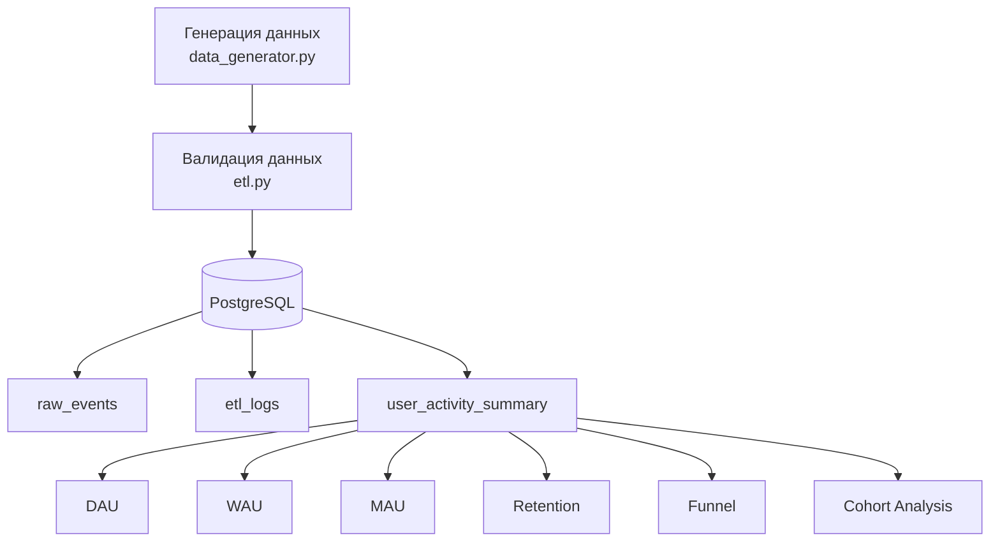
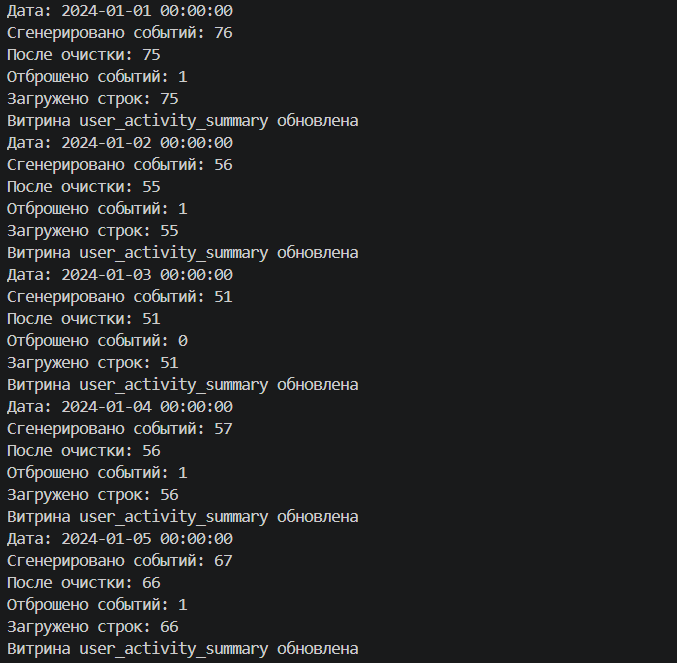
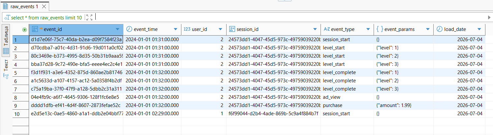
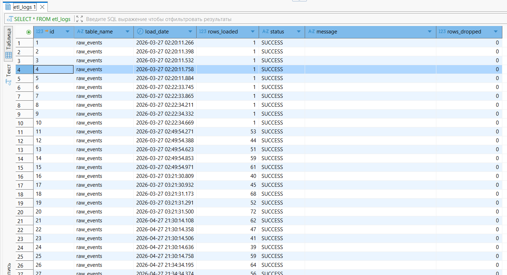
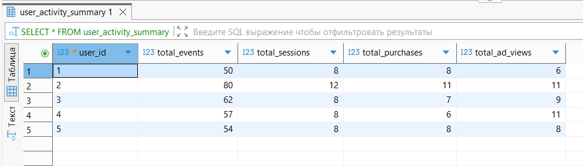
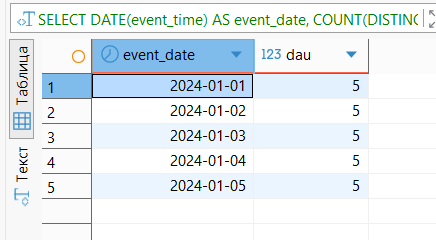

# Game Data ETL Pipeline

## Описание проекта
Проект представляет собой ETL-пайплайн для обработки игровых событий. В рамках проекта реализована генерация данных, их валидация, загрузка в PostgreSQL, логирование процесса ETL, построение аналитической витрины и расчет основных продуктовых метрик с помощью SQL.

Проект разработан в учебных целях для демонстрации навыков работы с Python, PostgreSQL и SQL-аналитикой.

## Используемые технологии

В проекте использовались следующие технологии:

* **Python 3** — генерация данных, ETL-пайплайн и автоматизация процессов.
* **PostgreSQL** — хранение игровых событий, логов ETL и аналитических витрин.
* **psycopg2** — подключение Python к PostgreSQL.
* **SQL** — создание таблиц, построение витрин и расчет продуктовых метрик.
* **Git** — контроль версий проекта.
* **GitHub** — хранение исходного кода и документации проекта.
* **Visual Studio Code** — разработка проекта.
* **DBeaver** — работа с базой данных и выполнение SQL-запросов.

## Структура проекта

```text
GD_project/
├── config.py            # Настройки подключения к PostgreSQL
├── data_generator.py    # Генерация игровых пользователей, сессий и событий
├── etl.py               # Валидация и загрузка данных в базу данных
├── analytics.py         # Обновление аналитической витрины
├── logger.py            # Создание ETL-логов и запись информации о выполнении
├── game_etl.py          # Основной ETL-пайплайн
└── README.md            # Документация проекта
```

### Назначение файлов

* **config.py** — содержит параметры подключения к базе данных PostgreSQL.
* **data_generator.py** — генерирует пользователей, игровые сессии и события.
* **etl.py** — выполняет проверку данных и загружает корректные события в базу данных.
* **analytics.py** — обновляет аналитическую витрину `user_activity_summary`.
* **logger.py** — отвечает за создание таблицы логов ETL и запись информации о каждой загрузке.
* **game_etl.py** — управляет выполнением всего ETL-процесса.
* **README.md** — содержит описание проекта и инструкцию по его использованию.

## Архитектура проекта




## Структура базы данных

В проекте используется база данных PostgreSQL `game_data`.

### Таблица `raw_events`

Основная таблица, в которую загружаются игровые события после прохождения валидации.

Основные поля:

* `event_id` — уникальный идентификатор события;
* `event_time` — дата и время события;
* `user_id` — идентификатор пользователя;
* `session_id` — идентификатор игровой сессии;
* `event_type` — тип события;
* `event_params` — дополнительные параметры события;
* `load_date` — дата загрузки записи в базу данных.

### Таблица `etl_logs`

Содержит информацию о каждом запуске ETL-пайплайна.

Основные поля:

* `table_name` — название таблицы, в которую выполнялась загрузка;
* `load_time` — время выполнения загрузки;
* `rows_loaded` — количество успешно загруженных строк;
* `status` — статус выполнения (`SUCCESS` или `ERROR`);
* `error_message` — текст ошибки (если она возникла);
* `rows_dropped` — количество отброшенных событий.

### Таблица `user_activity_summary`

Аналитическая витрина, которая содержит агрегированную информацию по активности пользователей.

Витрина используется для расчёта продуктовых метрик, таких как:

* DAU;
* WAU;
* MAU;
* Retention;
* Funnel;
* Cohort Analysis.

## ETL-процесс

ETL-пайплайн выполняет следующие шаги:

1. Генерирует игровых пользователей, сессии и события.
2. Проверяет корректность сгенерированных данных.
3. Отбрасывает некорректные события.
4. Загружает валидные данные в таблицу `raw_events`.
5. Записывает информацию о выполнении ETL в таблицу `etl_logs`.
6. Обновляет аналитическую витрину `user_activity_summary`.
7. Подготавливает данные для последующего анализа с помощью SQL-запросов.

## Реализованные аналитические метрики

В рамках проекта с помощью SQL были рассчитаны следующие продуктовые метрики:

## DAU (Daily Active Users)

Количество уникальных пользователей, которые были активны в течение дня.

## WAU (Weekly Active Users)

Количество уникальных пользователей, которые были активны в течение недели.

## MAU (Monthly Active Users)

Количество уникальных пользователей, которые были активны в течение месяца.

## Retention

Метрика удержания пользователей, показывающая, какой процент пользователей возвращается в приложение спустя определённое время после первого посещения.

## Conversion Funnel

Воронка событий, позволяющая оценить конверсию пользователей между основными этапами игрового процесса.

## Cohort Analysis

Когортный анализ, который объединяет пользователей по дате первого посещения и позволяет сравнивать их поведение во времени.

## Cohort Retention Matrix

Матрица удержания пользователей по когортам, демонстрирующая изменение Retention для разных групп пользователей.

## Запуск проекта

### 1. Клонировать репозиторий

```bash
git clone https://github.com/Katusha-tech/Game-data-generator.git
```

### 2. Перейти в папку проекта

```bash
cd GD_project
```

### 3. Установить необходимые библиотеки

```bash
pip install psycopg2
```

### 4. Создать базу данных PostgreSQL

Создать базу данных `game_data` и настроить параметры подключения в файле `config.py`.

### 5. Запустить ETL-пайплайн

```bash
python game_etl.py
```

После запуска будут:

* сгенерированы игровые события;
* выполнена валидация данных;
* загружены данные в таблицу `raw_events`;
* обновлена аналитическая витрина `user_activity_summary`;
* записана информация в таблицу `etl_logs`.

## Результат проекта

В результате выполнения проекта:

* реализован модульный ETL-пайплайн на Python;
* организовано хранение данных в PostgreSQL;
* автоматизировано логирование процесса загрузки;
* построена аналитическая витрина;
* рассчитаны основные продуктовые метрики с помощью SQL.

## Продемонстрированные навыки

В ходе разработки проекта были применены следующие навыки:

* разработка ETL-пайплайнов на Python;
* работа с PostgreSQL;
* написание SQL-запросов;
* построение аналитических витрин;
* расчёт продуктовых метрик (DAU, WAU, MAU, Retention, Funnel, Cohort Analysis);
* валидация данных;
* логирование ETL-процессов;
* модульная организация кода;
* работа с Git и GitHub.

## Возможные улучшения

Проект может быть расширен следующими возможностями:

* автоматический запуск ETL по расписанию;
* интеграция с Apache Airflow;
* расчёт дополнительных продуктовых метрик (ARPU, ARPPU, LTV);
* визуализация метрик с помощью BI-инструментов;
* контейнеризация проекта с использованием Docker.

## Скриншоты проекта

### Выполнение ETL-пайплайна



### Таблица raw_events



### ETL Logs



### Аналитическая витрина



### Пример расчёта DAU

